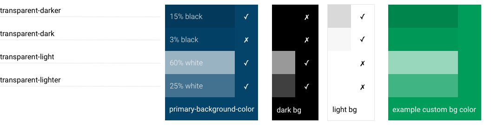
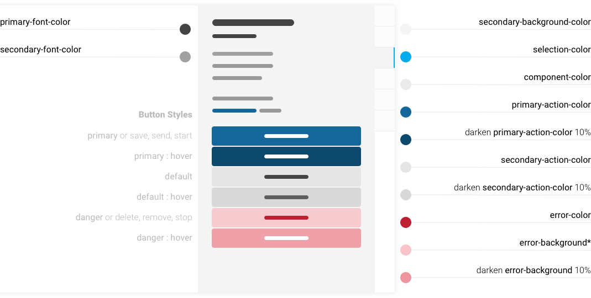

# UI Colors

> NB: The UI is in active development and component refactoring will change \(and hopefully improve\) the use of color. The immediate goal is to consolidate use of color and styles, before moving forward to a consistent style guide for Rocket.Chat.

[Most](https://github.com/RocketChat/Rocket.Chat/issues/4091)\* use of color in Rocket.Chat can be customised by changing color settings under Administration &gt; Layout &gt; Colors. We encourage developers to use the defined variables in their contributions \(instead of hard-coding colors\), to allow site owners to change the color scheme with consistent results.

See the [theme variables file](https://github.com/RocketChat/Rocket.Chat/blob/develop/app/theme/server/variables.js) for current available color settings. All color settings are available to Less files as variables, as long as the Less files were compiled using the `addPackageAsset` method of `rocketchat-theme`.

## Color Scheme

The Rocket.Chat color scheme consists of three groups of color settings, Alpha, Major and Minor Colors.

Some further variations of these colors are created in Less and not exposed to settings.

The naming of color settings/variables is not related to any specific component, the names reflect the visual hierarchy that will \(hopefully\) make it obvious and easy to carry forward consistent color usage in newly contributed components and theme development.

### Alpha Colors

Semi-transparent black or white, used in components to shade/tint the background color, e.g. to indicate a selected or disabled state. The use of alpha colors allows site owners to easily change color scheme without defining every variation for every state of a component.

* transparent-dark
* transparent-darker
* transparent-light
* transparent-lighter

#### Alpha Colors Example

### Major Colors

The primary palette of the app. Contributions and modifications to components should make use of these colors.

* content-background-color **\#FFFFFF**
* primary-background-color **\#04436A**
* primary-font-color **\#444444**
* primary-action-color **\#1d74f5**
* secondary-background-color **\#F4F4F4**
* secondary-font-color **\#A0A0A0**
* secondary-action-color **\#DDDDDD**
* component-color **\#f2f3f5**
* success-color **\#4dff4d**
* pending-color **\#FCB316**
* error-color **\#BC2031**
* selection-color **\#02ACEC**
* attention-color **\#9C27B0**

### Minor Colors

A set of minor colors for specific use cases will inherit from the major colors by default but can be used by admins who want more granular control over the color scheme.

* tertiary-background-color   _defaults to component-color_
* tertiary-font-color   _defaults to transparent-light_
* link-font-color   _defaults to primary-action-color_
* info-font-color   _defaults to secondary-font-color_
* custom-scrollbar-color   _defaults to transparent-dark_
* status-online    _defaults to success-color_
* status-away   _defaults to pending-color_
* status-busy   _defaults to error-color_
* status-offline   _defaults to transparent-darker_

### Dark UI

The computed colors allow owners to choose a **dark UI** with appropriate contrast. e.g. in a light UI, the disabled state might darken an element, but on a dark UI it should be lightened. The mixins achieve this by mixing the color with a contrast of the background color instead of using darken/lighten. See [this example](https://codepen.io/owlandfox/pen/EyJROO) of form input states that dynamically contrast to both dark and light backgrounds.

Developers are encouraged to use mixins and computed colors in contributions instead of hard-coding variations, to maintain consistent balance and contrasts of colors regardless how the scheme settings may be changed by owners.

## Default Colors

These examples show the implementation of the default color scheme with the main components of the Rocket.Chat UI.

### Side Nav

### Account Box

### Flex Nav

### Message Box

### Settings Page

