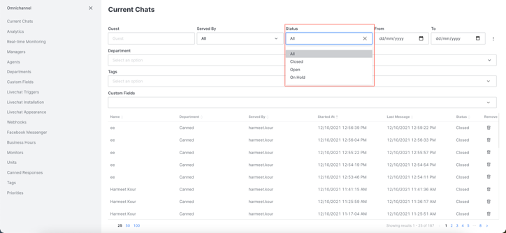

# Current Chats


`View Omnichannel Contact Center` permission should be assigned to your role to manage access to the contact center. Please contact your administrator to grant/revoke access to Omnichannel Contact Center.



If a chat was not deleted, it appears here.


You have various filters available to you to sort these conversations.

To access **Current Chats** settings:

Go to Omnichannel panel settings, as shown below:

Settings appear, as shown below:

Filters are explained below:

## 1. Sort by Visitor Name:

To sort the conversations per Guest/Visitor Name, enter the name in the field, and your conversations are sorted, as shown below:

.png>)

## 2. Sort by Agent Name:

To sort the conversations per Agent Name, enter the name in the field, and your conversations are sorted, as shown below:

.png>)

## 3. Sort by Department:

To sort the conversations per Department, enter the name in the field, and your conversations are sorted, as shown below:

.png>)

## 4. Sort by Status:

To sort the conversations per Open/Closed Status, choose the desired status in the field, as shown below:

and your conversations are sorted, as shown below:

.png>)


Please note that you now have the ability to filter on-hold chats.


## 5. Sort by From and To Date:

To sort the conversations per From and To Date, enter the From and To Date in the field, and your conversations are sorted, as shown below:

.png>)

## 6. Sort by Tags or Custom Fields:

You can also sort the conversations by Tags or any Custom Fields that you have added in your livechat widget user login. Enter the tag/custom field, and your conversations are sorted.

## 7. Clear Filters:

Hit **Clear filters** to clear all the filters you have set for your sort.

.png>)

## 8. Delete all Closed Chats:

Hit **Delete all closed chats** to delete all the chats that are marked closed by the agents.

.png>)
