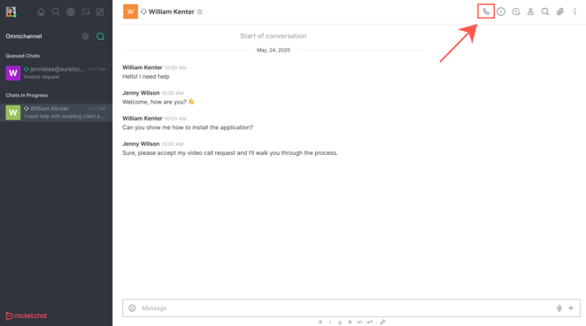
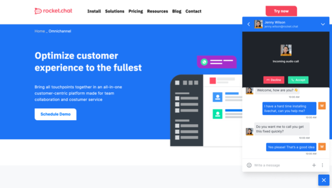
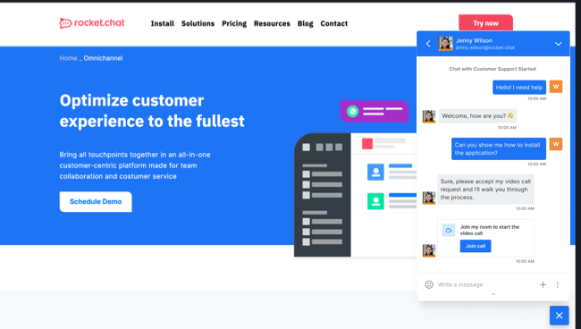
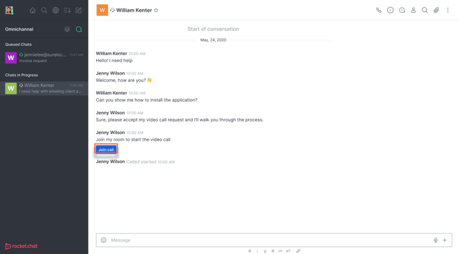
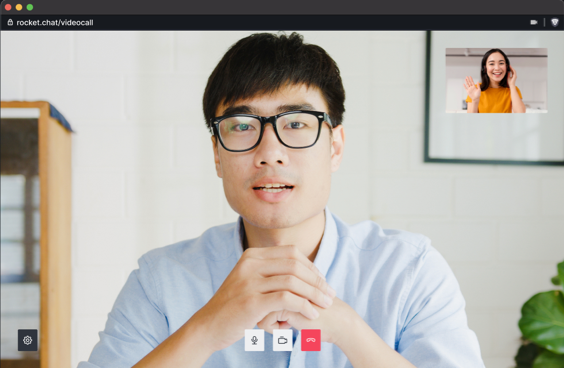

# Livechat Video/Audio Call Agent's Guide


To enable Rocket.Chat video call feature, please contact your administrator or follow the [instructions](https://docs.rocket.chat/guides/administration/settings/video-conference-admin-guide/omnichannel-video-audio-call-admins-guide).



The following flow is for web users but both (Web and Mobile) user journeys are supported.


**To initiate a call within an omnichannel conversation:**

Click on the call button to initiate a call with the visitor.

### Visitor's View

Your livechat visitor should get a notification on their side to **Accept** or **Decline** a call.

If the visitor accepts the call, the following screen appears where they can go ahead and hit **Join Call** to join the call.

Jitsi calling page opens in a new browser window where the visitor enters their name and click **Join meeting**:

Upon which the call starts, as shown below:


Please note that because the above screen opens in a new browser window, the visitor can leave the call and join back again.


### Agent's View

As an agent, you also see a \*\*`Click to Join!` \*\* button in the chat.

When you click to join the call, Jitsi calling page opens in a new browser window:

Enter your name and hit **Join meeting**, upon which the call starts:


Please note that for **WebRTC**, the flow is just the same.

