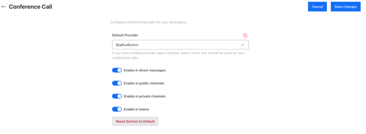

# BigBlueButton (BBB) app

BigBlueButton is virtual classroom software that has been designed around the real-world needs of teachers, students, and schools.

To start using BigBlueButton video conferencing on your Rocket.Chat Instance:

## 1. Download BigBlueButton app

To download the BigBlueButton app:

1. Please go to **Avatar Menu > Administration > Apps > Marketplace** tab.
2. Search **BigBlueButton** app
3. Hit **Install**

## 2. Set up BBB app ****&#x20;

To set up the BBB app on your Rocket.Chat instance:

1. Enable the BigBlueButton app on your Rocket.Chat instance
2. Run `sudo bbb-conf --secret` on the BBB server. It gives you a **URL** and a **Secret**. (Find BBB's [documentation](https://docs.bigbluebutton.org/admin/bbb-conf.html) here.)
3. Use this URL and Secret in the Settings on Rocket.Chat to connect to BBB, as shown below:

4\. Hit **Save Changes**

## 3. Configure conference call using BigBlueButton **app**&#x20;

To configure video conference on your Rocket.Chat instance:

1. Go to **Avatar Menu > Administration > Settings >  Conference call**
2. Select BigBlueButton app as your **Default Provider**

****

as shown below:

Select the options that meet your needs and hit **Save changes** in the top right corner. BigBlueButton app is successfully configured on your server. Please follow the conference call user's guide to start using it.


[conference-call-users-guide.md](../conference-call-users-guide.md)

