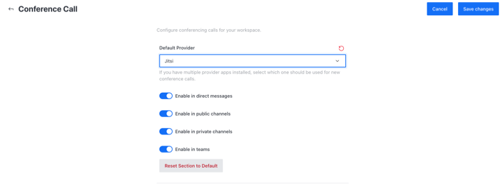

# Jitsi app

Jitsi is a [collection of Open Source projects](https://jitsi.github.io/handbook/docs/architecture) which provide state-of-the-art video conferencing capabilities that are secure, easy to use, and easy to self-host.

The [Jitsi Meet project](https://jitsi.org/Projects/JitsiMeet) (Jitsi Video Bridge) is a tried and true bandwidth-efficient WebRTC compatible SFU (server-based) solution from our gracious FOSS partner, [Jitsi](https://jitsi.org).

Through the collaboration arrangement with Jitsi, Rocket.Chat users can enjoy reliable and robust group video chat, audio chat, and screen sharing experiences.


**A Jitsi server is required for this integration.**


To start using Jitsi video conferencing on your Rocket.Chat Instance:

## 1. Download the Jitsi app

To Download the Jitsi app:

1. Navigate to **Avatar Menu > Administration > Apps > Marketplace** tab.
2. Search **Jitsi Video Conference Provider** app
3. Hit **Install**

## 2. Set up the Jitsi app&#x20;

To set up the Jitsi app on your Rocket.Chat instance go to settings in App info and:

1. **Enable** the Jitsi app on your Rocket.Chat instance
2. **Domain**: is your Jitsi domain
3. **Title prefix**: Text added before the title when identifying a video conference.
4. **Title suffix**: Your room suffix
5. **Use SSL**: Your Jitsi SSL
6. **Chrome Extension Id**: Your Jitsi chrome extension Id
7. **Use Authentication Token**: When enabled, Rocket.Chat will generate a JWT token using the settings below
8. **Application ID (iss)**: The app id to use when generating authentication tokens
9. **Application Secret**: The app secret to use when generating authentication tokens
10. **Limit token to Jitsi Room**: If enabled, generated tokens will grant access only to the intended jitsi room
11. **Token Auditor**: The name of the auditor to use when generating authentication tokens
12. Hit **Save Changes**

## 3. Configure conference call using Jitsi app

To configure video conference on your Rocket.Chat instance:

1. Go to **Avatar Menu > Administration > Settings >  Conference call**
2. Select Jitsi as your **Default Provider**

as shown below:

Select the options that meet your needs and hit **Save changes** in the top right corner. Jitsi app is successfully configured on your server. Follow the conference call user's guide to start using it.


[conference-call-users-guide.md](../conference-call-users-guide.md)

