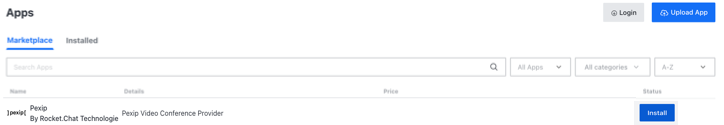
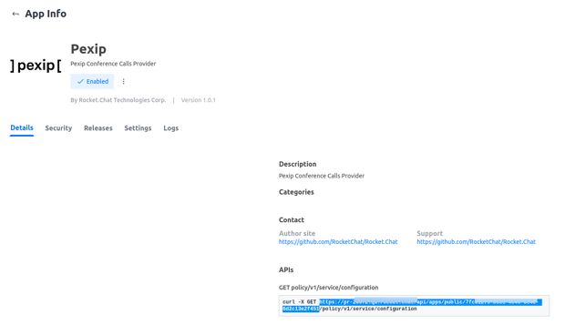

# Pexip app

 (3) (3) (3) (3) (3) (3) (3) (3) (2) (3) (1) (1) (1) (1) (10) (9).jpg>)

[Pexip](https://www.pexip.com/) is a purpose-built video communication platform that empowers large organizations to transform their operations with video. Pexip’s unique technology provides customized solutions for innovative and fully bespoke application of video, data privacy, and business continuity for secure spaces and frictionless collaboration for connected spaces.

The integration between Rocket.Chat and Pexip as video conferencing communication platform enable secure and compliant communication that is ideal for organizations operating within strict regulatory requirements relating to internal and external communications such as government, financial services, healthcare, and others.


**A Pexip server is required for this integration.**


To start using Pexip video conferencing app on your Rocket.Chat Instance:

## 1. Download the Pexip app

To Download the Pexip app:

1. Navigate to **Avatar Menu > Administration > Apps > Marketplace** tab.
2. Search **Pexip** app
3. Hit **Install**

## 2. Set up the app 

To set up the Pexip app on your Rocket.Chat instance:

1. Enable the Pexip app on your Rocket.Chat instance
2. [Configure the Pexip server ](https://docs.pexip.com/admin/integrate\_policy.htm)with remote policy to do service configuration requests before connecting with Rocket.Chat
3. You need to enter the below-shown part of the URL from the **App Details** page on Rocket.Chat as  **Policy server URL** on the Pexip side

4\. Enter the URL of your running Pexip conferencing node in the **Base URL** under **Settings** on Rocket.Chat side.

5\. Hit **Save Changes**

## 3. Configure conference call using Pexip app 

To configure the Pexip video conference on your Rocket.Chat instance:

1. Go to **Avatar Menu > Administration > Settings > Conference Call**
2. Select Pexip as your **Default Provider**

****

as shown below:

Select the options that meet your needs and hit **Save changes** in the top right corner. Pexip app is successfully configured on your server. Follow the conference call user's guide to start using it.


[conference-call-users-guide.md](../conference-call-users-guide.md)

