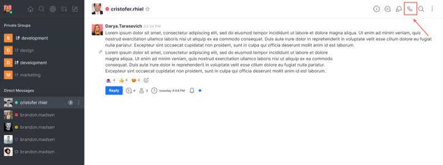
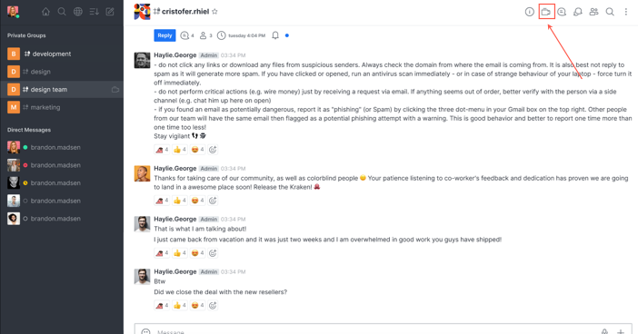
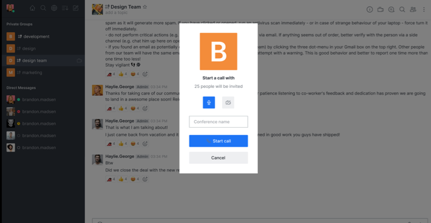

# Conference Call User's Guide

If you are using the conference call feature for the first time on Rocket.Chat, contact your administrator or follow the admin guide linked below to configure conference calling on your Rocket.Chat instance.


[conference-call-admin-guide](conference-call-admin-guide/)


In Rocket.Chat you can initiate video and audio conferences using your chosen provider in:

1. [Direct call (within _Direct Messages)_](conference-call-users-guide.md#direct-messages)__
2. [Conference call (within _Teams_, _Channels_, _Discussion_, _Multiple Direct Messages_)](conference-call-users-guide.md#conference-call)

## Direct Messages

### Initiating a direct call

Click the **phone** icon to initiate a direct call from within a _Direct Message_ **** conversation, as shown below:

In the next step, check the user avatar and user status. Here you are also given the option to start the call with the camera turned off and microphone muted, as shown below:

.png>)

After confirmation, a call pop-up appears in the top right corner and the ringer starts. This enables you to perform other actions while you wait for the receiver to answer. The ringer stays active for 30s, after that **Call again** button appears in the channel.  &#x20;

### Receiving a direct call

A pop-up and a ringer appear on the receiver side.&#x20;

## Conference

### Initiating a video conference

Click the **Video conference** icon to initiate a conference call from within a _Teams_, _Channels_, _Discussion_, _Multiple Direct Messages_ **** conversation, as shown below:

In the next step, you are given the option to start the conference call with the camera turned off and the microphone muted. You can also name your conference call, as shown below:

### Joining a conference call

Ongoing calls are shown as **Join** button in the room and the room members who have joined. Click **Join** button to join a conference call.

### Video conference logs

The counter on the video conference icon shows the number of ongoing calls in the room. After a conference is ended, the room keeps a record of:

* the user who initiated it
* the start time
* name of the conference and,
* attendees&#x20;

The video conference contextual bar keeps organized all conferences that happened on a channel.&#x20;
