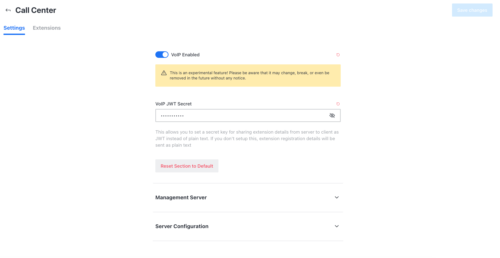

# Configure with an active PBX server

If you have:

1. an active PBX server
2. SIP extensions created
3. Asterisk manager configured
4. and [omnichannel activated](https://docs.rocket.chat/guides/omnichannel#omnichannel-activation)

You can start to configure the voice channel or call center or VoIP on your Rocket.Chat instance.

## 1. Enable VoIP

1. Go to **Avatar Menu > Administration > Settings > Call Center**
2. Enable VoIP, as shown below:

Rocket Chat establishes two connections with Asterisk, one via AMI to read configuration and list extensions, queues, and some other things, and the second one is the WebRTC SIP registration.

## 2 Configure AMI connection

Go to the menu **Avatar Menu > Administration - Settings - Call Center** and in the **Management Server** section you fill the form with the FQDN of your server, and the user/password that we just [here](https://docs.rocket.chat/guides/rocket.chat-call-center/getting-started-with-call-center/configure-without-previously-having-a-pbx-server) or should be provided to you by your _Asterisk manager._

### 2.1 Test AMI Connection&#x20;

To test AMI connection turn to the **Extensions** tab, here you should see a list of the existing extensions in Asterisk:

## 3. Configure WebSocket Server Connection

Rocket.Chat needs a WebSocket connection to forward calls from Asterisk to Rocket.Chat.

The parameters for a FreePBX connection are:

Change them according to your Asterisk server conditions. Then in the Settings tab assign at least one extension to a Rocket.Chat user. When that user logs in to Rocket.Chat the webphone will try to connect to Asterisk.

### 3.1 Test WebSocket Connection&#x20;

To test the WebSocket Connection you just need to log in with a user associated with an extension and check if the extension registers successfully.&#x20;

The phone icon with a slash over means that the WebSocket connection is possible, Rocket.Chat could send a SIP Options packet to Asterisk, and it was successfully answered. Click on the phone icon and it will turn green. Now the user is ready to receive calls, and in Asterisk, you should have received a SIP register packet and the extension should be properly registered. Validate it with:

`pjsip show endpoints`

Congratulations! You have successfully configured Rocket.Chat with Asterisk!\
