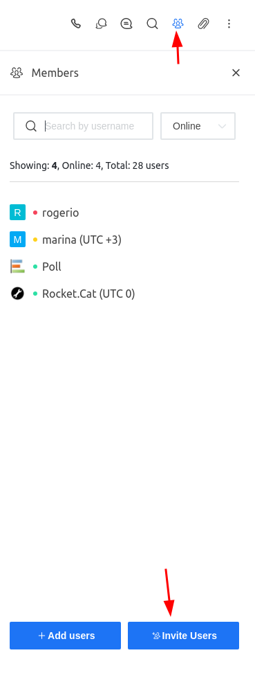
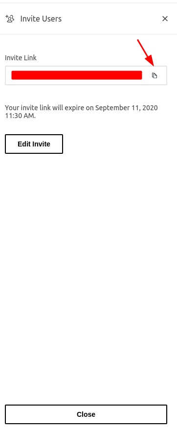
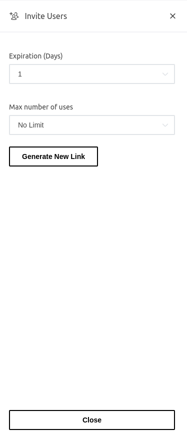

# Invite Links

The invite link functionality allows an user to send an invitation to an external user. This invitation must be done inside a channel and it will ask for the external user to register himself within Rocket.Chat platform.

## Creating an invite link

Within the channel/room you want to invite the external user, go to "Members" and select the "Invite Users" option

This will lead to another screen, where the invite link is available for the user to copy and share with the external user

## Editing an invite link

The generated invite link can be edit to restrict the amount of users can be invited with that link and the expiration time \(in days\)

