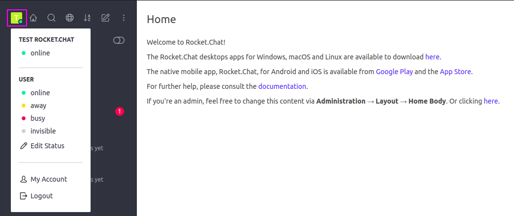

# User Panel

Located on the upper left side of the screen, the user panel allows the end user to edit his status and personal preferences and settings. When clicking the avatar icon, a panel will be displayed as below:

The User Panel is divided into three main sections

* **Name and Current Status:** Displays the user name and the current status selected by the user
* **Status selection:** The second section shows the statuses available for the end user to choose: online, away, busy or invisible. 
  * The _Edit Status_ option allows the user to customize his status by adding a custom status message
* **My Account and Logout**

