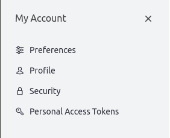
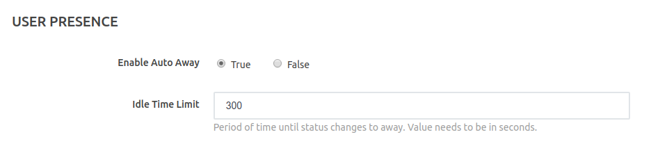
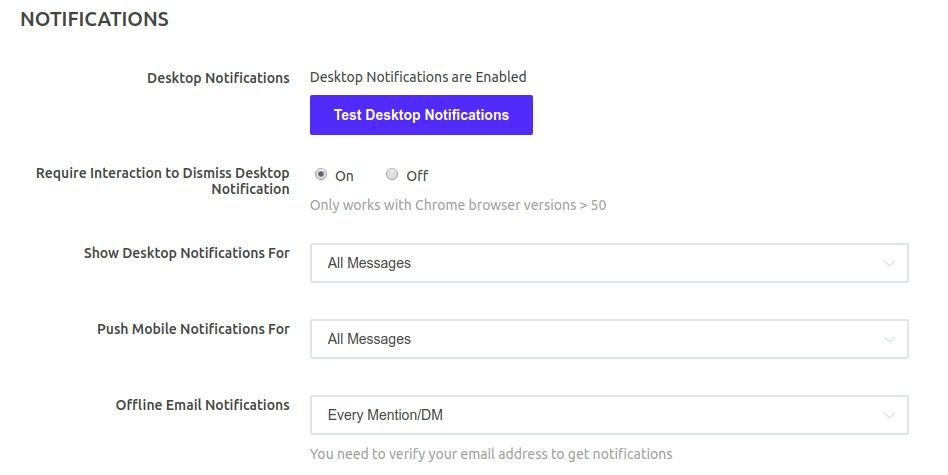

# My Account

Manage Your Rocket.Chat account settings through the browser, desktop, and mobile apps.

## Access account settings

To access and manage your Rocket.Chat account on a server:

[Log in](../login.md) to the server with your username and password. Click your profile picture and select **My Account**.

Account settings changed on a single server **do not** change settings on a different server.

You can change the following account settings:

## Preferences

In the _Preferences_ section the end user has the ability to configure and set his own user preferences on Rocket.Chat server.

### Localization

Set the language to use for the Rocket.Chat user interface.

### User Presence

Enable Auto Away: This setting enables the auto away functionality, which changes the status to _away_ after an idle period. The idle time limit is configured in the field below \(in seconds\)

### Notifications

### 

This section allows the end user to change his notification preferences.

* Require Interaction to Dismiss Desktop Notification: This setting enables the possibility to disable the desktop notification while Rocket.Chat is being used
* Show Desktop Notifications: User can select for which types of messages the notifications should be triggered \(for both browser and desktop app notifications\)
* Push Mobile Notifications: User can select for which types of messages the notifications should be triggered \(for mobile notification\)
* Offline Email Notifications

### Sidebar

Group discussions: Controls the ability to group discussions in the sidebar

### Messages

Enable or disable all desktop notifications, test desktop notifications, and configure:

* The global notification duration in seconds
* Enter key behaviour:
  * Normal mode \(send with Enter\)
  * Alternative mode \(send with Enter + Ctrl/Alt/Shift/CMD\)
  * Desktop mode \(only sends with Enter on desktop\)
* View mode
  * Normal: The default spacing between messages
  * Cozy: More space between messages \(less on the screen\)
  * Compact: Less space between messages \(more on the screen\)
* Offline Email Notifications
  * Disabled
  * Every Mention/Direct Message

As well as enable or disable the following preferences:

* **Unread Tray Icon Alert**: Toggles if the tray icon highlights when you have unread messages
* \_\_Use Emojis: Toggles emojis in messages
* **Convert ASCII to Emoji**: Toggles emoji conversion when inputting ASCII characters
* **Auto Load Images**:  Disables clicking on images to preview them
* **Save Mobile Bandwidth**: Saves mobile data when the app is open
* **Collapse embedded media by default**:  Toggles if messages with files collapse by default
* **Unread Rooms Mode**: Creates a new section on the channel list with all channels with unread messages
* **Hide usernames**: Hides usernames on the channels, showing only the users avatars
* **Hide roles**: Hides role tags from users
* **Hide right sidebar with click**: Automatically closes the right sidebar when clicked.
* **Hide Avatars**: Hides avatars on the channels, showing only the users' usernames
* **Group by Type:**:  Groups your channels by Type or merge them in a single list

### Highlights

Specify a comma-separated list of words or phrases to trigger notifications for when mentioned by anyone in public or private channels of which you are a member

### Sound

Configure audio notifications used for the following:

* New Room
* New Message

Available audio notifications:

* None
* Beep
* Chelle
* Ding
* Droplet
* Highbell
* Seasons

## Profile

Verify and edit the following profile information:

* Name
* Username
* Email
* Set a new password

Upon verification of your email by the Rocket.Chat server, a check appears alongside it.

Should you need another verification email, select the **Verify email** option.

To set or change your avatar for a Rocket.Chat server, click on one of the images beside your current avatar. To upload a new avatar, click the **Upload Avatar** option.

## Security

Enable or disable Two Factor Authentication \(2FA\) for your account on a Rocket.Chat server.

When you enable 2FA, you are required to get a key code from an app on your phone, thus increasing security when logging in.

**Note**: 2FA can be turned on and off by the system admin, if you can't find this setting, please contact your system admin.

To enable 2FA, you need to:

* Click the **Enable two-factor authentication** button.
* Use an authentication app, such as Google Authenticator, Authy, or Duo, to scan the QR code. Scanning the QR code displays a six-digit code. Enter the code into Rocket.Chat.
* Copy your backup code somewhere safe if you need to access it in the future without the authentication app. Click **Send** to finish.
* To disable the 2FA, click on **Stop two-factor authentication**.

