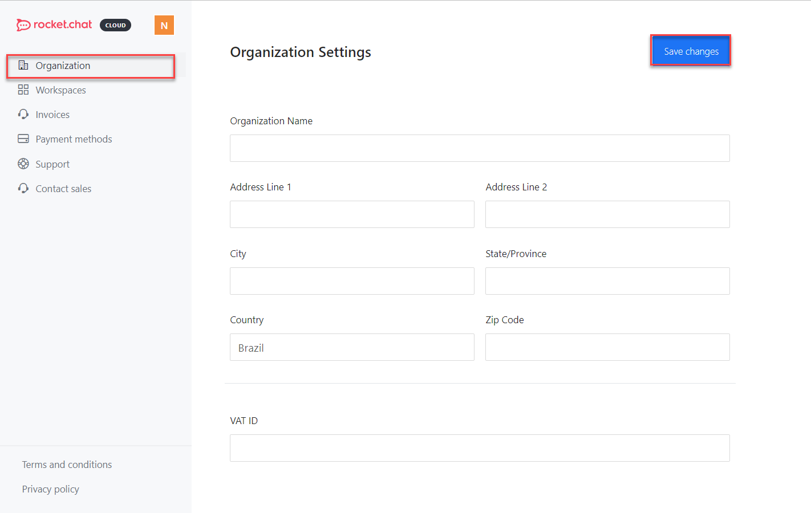

# Organization Settings

As a workspace administrator, you can add information about your organization.

### Add your organization information

* Click **Organization.**  Enter the details as prompted and then click **Save Changes**.

