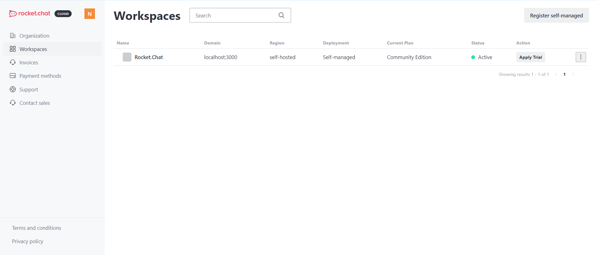

# Workspaces

As a workspace administrator, you can view all the workspaces linked to your account.

### Manage Workspaces

As soon as you log in, you will see the list of workspaces linked to your cloud account, as shown below:

To register a self-managed workspace, click **Register self-managed** to enable your self-hosted workspace.

If you want multiple cloud workspaces under the same cloud account, please contact us at [support@rocket.chat](mailto:support@rocket.chat).
