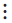
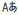

# Google Cloud Features

## Google Auto Translate

Every communication you receive on a channel can be translated using the Google translation engine. You require a Google Translate API key for that. The [official Google API documentation](https://cloud.google.com/translate/pricing) explains how to get and use a Google Translate API key.

## Getting the key

To get the Google Translate API Key,&#x20;

* Go to [Google Cloud Console](http://cloud.google.com/console/).
* Create a Project and select it.
* On the navigation menu, go to **APIs & Services >** **Dashboard.**
* Click on **ENABLE APIS AND SERVICES** and search for Cloud Translation API.
* Go to **Credentials.**
* Click **Create credentials.**
* Select **API key.**

## Configuration

It's time to configure auto-translate in your workspace now that you have your API key.t.

* Go to **Administration > Workspace > Settings > Message >Auto-Translate**
* **Enable Auto-Translate**.&#x20;
* Select **Google** as the **Service Provider**.


Only users with the `auto-translate` [permission](../../use-rocket.chat/workspace-administration/permissions.md) will be able to use this feature. See


## Enabling Auto-Translate on a Channel

Any messages sent in a language that **Google Translate** supports will be translated into your chosen language when you enable Auto-Translate in a room.

> The translated messages are only visible to you. The original, untranslated messages is displayed for users who have not enabled Auto Translation.

To activate Auto-Translate in a room,

* Click the  **three-dot icon** in the room header.
* Select **Auto-Translate**. &#x20;
* Enable **Automatic Translation** and select your desired language**.**
* Now, an **auto-translate icon**  is displayed beside the room name to indicate that the feature is active.

To translate a messaage,&#x20;

* Hover over the message and click the  **three-dot icon.**
* Select **Translate**.
