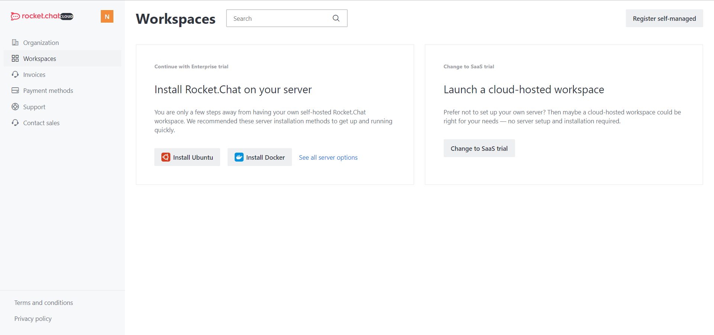

# Create your new cloud account

Rocket.Chat Cloud allows you to connect your self-hosted Rocket.Chat workspace to services we provide in our Cloud.

Rocket. Chat Cloud enables you to manage your workspace better. You can explore the workspace capabilities for free by signing up for a [30-day Rocket.Chat Enterprise Edition Trial](../../setup-and-configure-rocket.chat/enterprise-edition-trial/). You will get a notification in advance of when the trial is coming to an end. If you purchase any plan, your trial version will automatically convert to a paid plan at the end of the trial period.

#### Before you begin

If you are a self-managed customer**,** a cloud account is optional, but if you are a SaaS customer, it is created by default when you first start your workspace with us.

## Create a new cloud account

Log in to your Rocket.Chat Cloud account using your email or create a new account if you don't have one.&#x20;

* Go to [https://cloud.rocket.chat/register](https://cloud.rocket.chat/register).&#x20;
* Click **Create Account** to register your new Rocket.Chat cloud account.

* Enter your name.&#x20;
* In the "**Email**" field, enter your contact email address.&#x20;
* Enter and confirm your password.
* Make sure to accept the Rocket.Chat Terms and Conditions and Privacy Policy.
* Click **Next.** You will receive an email with the confirmation link to sign in to your cloud account.
* Next, go to your inbox and confirm your email address by clicking on the link we sent; your cloud account has been created and is ready to use.&#x20;

To begin with, you will see a **Workspaces** page with all the workspaces linked to your cloud account.

