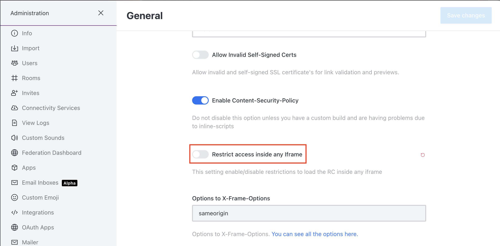

# Livechat Widget Installation

The Live Chat Widget is a chat interface that can be embedded into a webpage. This can serve in so many use cases like:

* Offering Live and real-time support to customers/users
* Embedded to get information from people interacting with your website

In this section, you'll learn how to install the Live Chat widget on your website.

To access this menu, go to **Administration** > **Omnichannel** > **Live Chat Installation**.

### To install the Live Chat widget:

* Copy the given piece of code

.png>)

* Paste this code above the last **\</body>** tag on your site
* The Live Chat widget will appear at the bottom right corner of your webpage

Visitors on your webpage will be able to click on it to initiate a conversation.

### Deploying Live Chat Widget to a different domain

To run the Live Chat Widget on a domain different from that of your Rocket.Chat server, you need to disable **Restrict access inside any iframe** on your Rocket.Chat server.

To do that, navigate to **Administration** > **Workspace** > **Settings** > **General**

