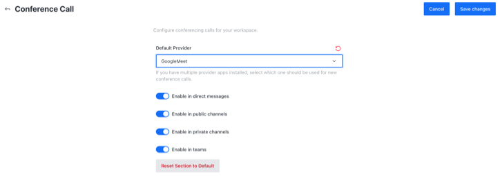

# Google Meet app

 (3) (3) (3) (3) (3) (3) (3) (3) (2) (3) (1) (1) (1) (1) (1) (1) (1).jpg>)


**The app is currently in Beta and some features may not function as expected.**&#x20;


To start using Google Meet video conferencing on your Rocket.Chat Instance:

## 1. Download the Google Meet app

To Download the Google Meet app:

1. Navigate to **Avatar Menu > Administration > Apps > Marketplace** tab.
2. Search **Google Meet**
3. Hit **Install**

## 2. Enable the Google Meet app

Please enable the Google Meet app on your Rocket.Chat instance.

## 3. Configure conference call using Google Meet

To configure video conference on your Rocket.Chat instance:

1. Go to **Avatar Menu > Administration > Settings >  Conference Call**
2. Select Google Meet as your **Default Provider**

as shown below:

Select the options that meet your needs and hit **Save changes** in the top right corner. Google Meet app is successfully configured on your server. Follow the conference call user's guide to start using it.


[conference-call-users-guide.md](../conference-call-users-guide.md)

