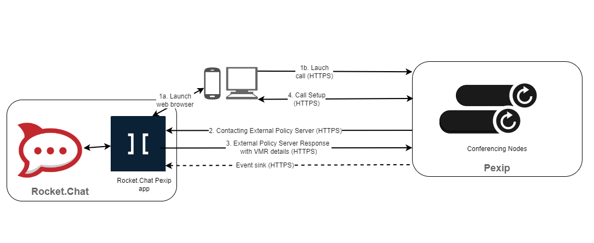

# 👑 Pexip app

 (3) (3) (3) (3) (3) (3) (3) (3) (2) (3) (1) (1) (1) (1) (1) (1) (1) (11) (17).jpg>)


This app can also work in a fully air-gapped environment. If you are an Enterprise customer running an air-gapped workspace, follow the [Air-gapped App installation guide](../../../setup-and-configure/rocket.chat-air-gapped-deployment/air-gapped-app-installation.md) and continue with the configuration instructions below.


[Pexip](https://www.pexip.com/) is a purpose-built video communication platform that empowers large organizations to transform their operations with video conferencing. Pexip’s unique technology provides a customized solution for an innovative and fully bespoke application of video, data privacy, and business continuity for secure spaces and frictionless collaboration for connected spaces.

The integration between Rocket.Chat and Pexip, a video conferencing communication platform, enables secure and compliant communication that is ideal for organizations operating within strict regulatory requirements for internal and external communications, such as government, financial services, healthcare, and others.

## Architecture&#x20;

This integration is made possible by connecting Rocket.Chat with Pexip infinity through its external policy API. The Rocket.Chat Pexip App acts as a relay between the two platforms. Rocket.Chat users initiate a video call to a Pexip conferencing node and trigger an external policy request to Pexip. The policy server creates a single-use Virtual Meeting Room (VMR) and responds with the meeting parameters. This VMR is made available in the Rocket.Chat room for its duration.


Ensure that the Rocket.Chat external policy server can connect to the Pexip Infinity Conferencing Nodes over HTTPS on port 443.


<figure><figcaption>
Rocket.Chat Pexip Architecture
</figcaption></figure>

## Setup

For a complete setup, here are some requirements you need:

* A Rocket.Chat workspace with Enterprise license.
* A [Pexip infinity server deployed](https://docs.pexip.com/admin/installation\_overview.htm) with:
  * [Valid certificates and intermediate certificates](https://docs.pexip.com/admin/certificate\_management.htm).
  * [A suitable network routing between Rocket.Chat and Pexip Infinity](https://docs.pexip.com/admin/port\_usage.htm)
  * Only one location for each Rocket.Chat workspace, but that location can contain multiple **Conferencing Nodes**.

### Download the Pexip app

To Download the **Pexip** app,

* Go to **Administration > Apps > Marketplace.**
* Search for the **Pexip** app.
* Click **Install**

### App Configuration&#x20;

To set up the **Pexip** app on your Rocket.Chat workspace,

* Confirm that the app is enabled.
* [Configure the Pexip server ](https://docs.pexip.com/admin/integrate\_policy.htm)with a remote policy to make service configuration requests before connecting with Rocket.Chat. Copy the policy server URL (**GET policy/v1/service/configuration**) from the details tab of the app and update the Pexip settings.
* Enter the URL of your running Pexip conferencing node in the **Base URL** under **Settings** on Rocket.Chat Pexip app.
* &#x20;Hit **Save Changes.**

### Configure conference call using the Pexip app&#x20;

To configure the Pexip video conference on your workspace,

* Go to **Administration > Settings > Conference Call**
* Select Pexip as your **Default Provider**
* Select the options that meet your needs and click **Save changes.**&#x20;

The Pexip app is successfully configured on your server. Follow the [conference call user's guide](../conference-call-users-guide.md) to start using it.

### Using the Pexip app

After successfully installing and configuring the Pexip app, you can initiate a secure Pexip call inside any Rocket.Chat room by using the slash command `/pexip` or the call icon in the room header.&#x20;

When you use the `/pexip` command, a new Pexip Virtual Meeting Room(VMR) is created, and a link is made available in the room for users to use and **Join call**. When you click the **call icon** in any Rocket.Chat room hit **Start call**. It rings and notifies users in that room to **Accept** or **Reject** the call. On joining the call, they are prompted to provide their details and grant permission for Camera and Microphone usage. The list of users joining the VMR can also be seen within the Rocket.Chat room.
