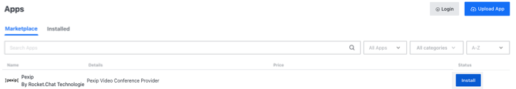
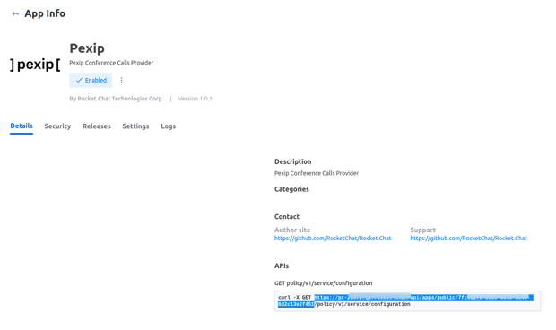
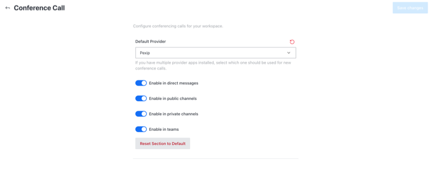

# Pexip app

 (3) (3) (3) (3) (3) (3) (3) (3) (2) (3) (1) (1) (1) (1) (1) (1) (1).jpg>)


This app can also work in a fully air-gapped environment. If you are an Enterprise customer running an air-gapped workspace, follow the [manual-app-installation.md](../../../setup-and-administer-rocket.chat/rocket.chat-air-gapped-deployment/manual-app-installation.md "mention") guide and then follow the configuration instructions below.


## Introduction

[Pexip](https://www.pexip.com/) is a purpose-built video communication platform that empowers large organizations to transform their operations with video conferencing. Pexip’s unique technology provides a customized solution for an innovative and fully bespoke application of video, data privacy, and business continuity for secure spaces and frictionless collaboration for connected spaces.

The integration between Rocket.Chat and Pexip, as video conferencing communication platform, enable secure and compliant communication that is ideal for organizations operating within strict regulatory requirements relating to internal and external communications, such as government, financial services, healthcare, and others.

## Architecture&#x20;

This integration is made possible by connecting Rocket.Chat with Pexip infinity through its external policy API. The Rocket.Chat Pexip App acts as a relay between the two platforms.

Pexip video meetings created by Rocket.Chat users, with the help of the Pexip app initiate a video call to a Pexip Conferencing Node and triggers an external policy request to Pexip. The policy server creates a single-use Virtual Meeting Room (_VMR_) and responds with the meeting parameters.\
This VMR is made available in the Rocket.Chat room for its duration.


Make sure that the Rocket.Chat external policy server can connect to the Pexip Infinity Conferencing Nodes over HTTPS on port 443.


See the illustration below for a summary

<figure><figcaption>
Rocket.Chat Pexip Architecture
</figcaption></figure>

## Setup


You are required to have:

* A Rocket.Chat workspace with Enterprise license.
* A [Pexip infinity server deployed](https://docs.pexip.com/admin/installation\_overview.htm) with:
  * A valid certificates and intermediate certificates [see more here](https://docs.pexip.com/admin/certificate\_management.htm)
  * With a suitable network routability between Rocket.Chat and Pexip Infinity [see more here](https://docs.pexip.com/admin/port\_usage.htm)
  * Only one location for each Rocket.Chat workspace, but that location can contain multiple Conferencing Nodes.


### 1. Download the Pexip app

To Download the Pexip app:

1. Navigate to **Avatar Menu > Administration > Apps > Marketplace** tab.
2. Search **Pexip** app
3. Hit **Install**

### 2. App Configuration&#x20;

To set up the Pexip app on your Rocket.Chat instance:

1. Enable the Pexip app on your Rocket.Chat instance
2. [Configure the Pexip server ](https://docs.pexip.com/admin/integrate\_policy.htm)with remote policy to do service configuration requests before connecting with Rocket.Chat
3. You need to enter the below-shown part of the URL from the **App Details** page on Rocket.Chat as  **Policy server URL** on the Pexip side

4\. Enter the URL of your running Pexip conferencing node in the **Base URL** under **Settings** on Rocket.Chat side.

5\. Hit **Save Changes**

### 3. Configure conference call using Pexip app&#x20;

To configure the Pexip video conference on your Rocket.Chat instance:

1. Go to **Administration > Settings > Conference Call**
2. Select Pexip as your **Default Provider**

****

as shown below:

Select the options that meet your needs and hit **Save changes** in the top right corner. Pexip app is successfully configured on your server. Follow the conference call user's guide to start using it.


[conference-call-users-guide.md](../conference-call-users-guide.md)


### 4. Using the Pexip app

After successfully installing and configuring the Pexip app, a secure Pexip call can be initiated inside any [Rocket.Chat room](../../user-guides/rooms/) by using the slash command or the call icon button

#### Starting Pexip call with Slash Command

* A Pexip call can be started with the slash command `/pexip`

<figure><figcaption>
Using Pexip slash command
</figcaption></figure>

* This creates a new Pexip Virtual Meeting Room(VMR) and a link is made available in the room for users to use and **Join call**

<figure><figcaption>
New Pexip VMR link in Rocket.Chat
</figcaption></figure>

* Members in that Rocket.Chat room can use the link to join the call&#x20;

#### Start Pexip Call with icon

* After configuring Pexip as a call provider, clicking on the call icon in any Rocket.Chat room lets you **Start a call**&#x20;

<figure><figcaption>
Start Call in Rocket.Chat room
</figcaption></figure>

* This rings and notify users in that room where the have the option to **Accept** or **Reject** the call

<figure><figcaption>
Rocket.Chat Pexip call ringing
</figcaption></figure>

On joining the call, they are prompted to provide their details and grant permission for Camera and Microphone usage

<figure><figcaption>
Join Pexip call
</figcaption></figure>

The list of users joining the VMR can be seen within Rocket.Chat

<figure><figcaption>
List of users in a Pexip call
</figcaption></figure>
