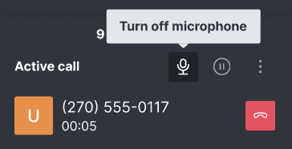

# How to take a call in Rocket.Chat voice channel?

After you [make yourself available](how-to-make-myself-available-for-accepting-voip-calls.md) to receive/make calls, you can start taking inbound calls.

## **Call Operations**

### **Call In Progress**

Click the **Accept** button to accept the call. The ongoing call appears as shown below:


Please note that messages are not available on a phone call room.


### Mute/Unmute Call

You have controls to mute/unmute calls.

### Hold/Unhold

If you're using Rocket.Chat's enterprise edition you can hold and unhold acording to your workflow needs.

 (2) (1) (1).png>)

### Device Settings

Enterprise edition also offers you the flexibilty to switch device during an ongoing call.

### Call Wrap-up

After the call ends you can leave your notes in the call wrap-up. It is an enterprise-only feature.

