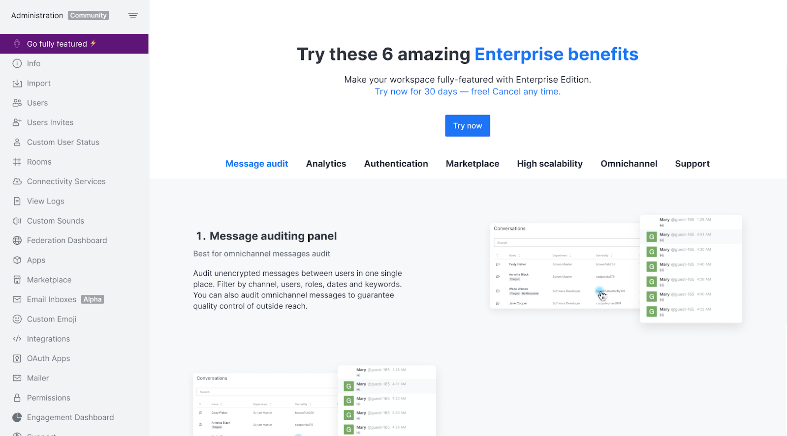

# Go Fully Featured

This tab inside the administration panel of community workspaces helps you to explore and unlock all the potential of Rocket.Chat's enterprise edition.

The new tab has two primary states. The first is to raise awareness of existing features that could be explored free of charge through a trial. The other state provides a guide on how to get value from them.
