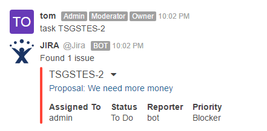

# Add Jira notifications via webhook

N\_otify on issue creation, deletion, status, resolution, comment, or priority changes.\_

1. In Rocket.Chat go to **Administration > Workspace > Integrations** and create **New Integration**
2. Choose Incoming Webhook
3. Follow all instructions like **Enable**, give it a name, link to channel etc. Set **Enable Script** to true and enter the content of [_this script_](https://github.com/malko/rocketchat-jira-hook/blob/master/jira-rocketchat-hook.js) in the **Script** box
4. Hit **Save changes** and copy the _Webhook URL_ (added just below the script box)
5. Go to your jira as administrator and follow instructions on adding an outgoing webhook [here](https://developer.atlassian.com/jiradev/jira-apis/webhooks#Webhooks-configureConfiguringawebhook)

You can tweak the content of the script to suit your needs better.

## Add Jira integration via outgoing webhook

_Integration for Rocket.Chat that summarizes any JIRA issues mentioned._

1. Go to [https://github.com/gustavkarlsson/rocketchat-jira-trigger](https://github.com/gustavkarlsson/rocketchat-jira-trigger) and follow the instructions.

Example of Jira integration:

