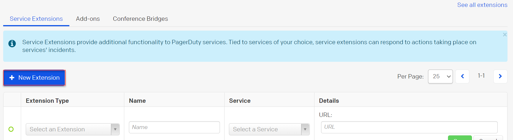

# PagerDuty

[PagerDuty](https://pagerduty.com) is an alarm aggregation and dispatching service for system administrators and support teams. It collects the alerts from your monitoring tools, gives you an overall view of all of your monitoring alarms, and alerts an on-duty engineer if there's a problem.

### **Admin Settings**

Log in as an administrator and go to **Administration > Workspace > Integrations > New Integration > Incoming Webhook** and configure the following settings:

* **Enabled:** Enable this option to integrate the PagerDuty with Rocket.Chat.
* **Name (Optional):** Enter the preferred name for your PagerDuty connection.
* **Post to Channel:** Messages that are sent to the Incoming Webhook will be posted here. Start with `@` for the user or `#` for the channel. Eg: `@john` or `#general`
* **Post as:** Choose the username that this integration will post as. The user must already exist.
* **Alias (optional):** Choose the alias that will appear before the username in messages.
* **Avatar URL (optional):** An option to override the avatar used to post from this integration. Should be a URL of an image.
* **Emoji (optional):** Use an emoji as an avatar. Example: `:ghost:`
* **Script Enabled:** Enable this option to add the script.
* **Script:** Paste contents of [rocketchat\_pagerduty\_incoming.js](https://github.com/kajisaap/rocketchat-pagerduty/blob/master/rocketchat\_pagerduty\_incoming.js) into the _Script_ field.
* **Webhook URL:** Copy the **Webhook URL** as soon as you save the integration and proceed to the configuration of generic webhook integration in PagerDuty.
* **Token:** An auto-generated token.
* **Example Payload:** Customize the payload template.

Click **Save.**

### PagerDuty

**To configure your webhook:**

1. In PagerDuty, navigate to the **Service Extensions > New Extension.**

1. For **Extension Type** select **Generic Webhooks(v3)**.
2. Enter a unique Extension Name e.g. rocketchatpage and choose the service.
3. Select the **Service** you wish to add.
4. Add the Webhook URL.

More details:\
[PagerDuty WebHook Docs](https://support.pagerduty.com/hc/en-us/articles/202830320-Webhooks)
