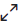

# Threads

**Threads** help to organize conversations and enable users to discuss topics without disorganizing a [room](../). They improve the ability to process room content, find, follow, and resume conversations more efficiently, keeping threaded discussions focused. Threads are a series of replies or follow-up conversations under any message in a [Team](../../../../guides/user-guides/rooms/teams/), [Channels](../channels/), [Discussion](../../../workspace-administration/settings/discussion.md), or [Direct Message](../../../workspace-administration/settings/discussion.md). They are identified by: 

## View Threads in a Room

To view the list of all threads in a room, click the **thread icon** in that room header.

## Expand and Follow a Thread

Since threads appear by the side of any room it was created in, you can expand the thread to occupy much space.

To **expand** a thread,&#x20;

* Click on the **expand icon** on the thread header.&#x20;

To **collapse** a thread,

* Click the **collapse icon** on the thread header.&#x20;

## Following a Thread

You can follow and unfollow threads to get notifications on any messages sent under that thread. By default, you automatically follow any thread you belong to.

To **follow** or **unfollow** a thread,&#x20;

* Click on the **bell icon** on the thread header.
