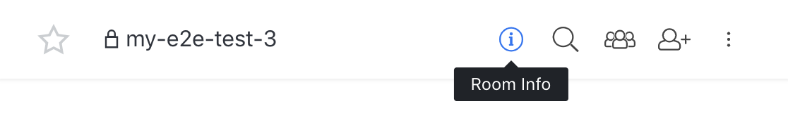
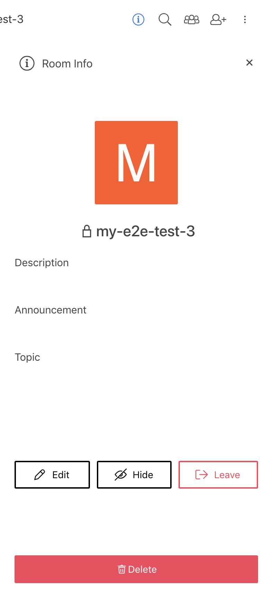

# End to End Encryption User Guide


**IMPORTANT:** **E2E encryption functionality is currently in beta** and includes notable restrictions that workspace owners should carefully consider before activating this feature for production use as follow:

* E2E encrypted messages will not appear in search operations&#x20;
* Bots or other ancillary systems interacting via webhooks or REST API will not be able to read E2EE encrypted messages&#x20;
* File uploads are not encrypted&#x20;
* Rocket.Chat enables users to reset their private E2EE key to avoid permanent loss of data during the beta period


## Getting started

Once your server admin has enabled End to End Encryption as an option you will see a banner across the top of your interface like this:

If you click this banner you will be presented with a dialogue containing a password. Rocket.Chat server does not know this password. So you will need to store it in your password manager along with your login password.

You will need this password on any other device you wish to participate in end to end conversations.

Once you have this password saved somewhere it is safe to dismiss the alert.

## Changing Encryption Password

If you would like to change your encryption password you can do so by going to: My Account->Encryption

Once you make this change it will be used for connecting on new devices.

## Starting an End to End Conversation

Click the channel creation icon

From this screen on private groups you can toggle Encrypted to on

## Convert an existing group to use End to End encryption

You can convert existing groups and direct messages to use end to end encryption.

As a room owner you can click the room info icon

Once this is up click the edit button

From here scroll to the bottom and toggle encrypted on

## FAQ

### How can I tell if the room is encrypted?

If the room is using End to End Encryption you should see a key icon by the channel name.

### How can I tell if a message is encrypted?

You will see a key icon by the username.

