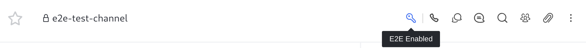

# End to End Encryption User Guide


**IMPORTANT:** **E2E encryption functionality is currently in beta** and includes notable restrictions that workspace owners should carefully consider before activating this feature for production use as follow:

* E2E encrypted messages will not appear in search operations&#x20;
* Bots or other ancillary systems interacting via webhooks or REST API will not be able to read E2EE encrypted messages&#x20;
* File uploads are not encrypted&#x20;
* Rocket.Chat enables users to reset their private E2EE key to avoid permanent loss of data during the beta period


## Getting started

To be able to use E2E Encryption, your Rocket.Chat workspace administrator must turn on the End to End Encryption feature.


[e2e-encryption.md](../../workspace-administration/settings/e2e-encryption.md)



With E2E enabled, users can create encrypted rooms and send encrypted messages.


### Set E2E Encryption Password

If E2E Encryption is enabled on your workspace, you see a banner notifying you to **Save Your Encryption Password**&#x20;

* Click on the banner
* A modal is seen with **Your password**
* Copy and store the password securely. It will be needed when using Rocket.Chat on another device
* Confirm by clicking on **I Saved My Password**

### Changing Encryption Password

To change your Encryption password,

* Click on your **User Profile**&#x20;
* Navigate down to **My Account**
* Click **Security** to open up the security tab
* Open E2E Encryption
* Set the **new encryption password**
* **Save changes**

## Starting an End to End Conversation

To create an End to End Encrypted room,&#x20;

* Follow this guide [create-a-new-channel.md](../rooms/channels/create-a-new-channel.md "mention") to create a room and switch on **Encrypted**

## Convert an existing room to use End to End encryption

To convert an existing room to an encrypted room, it must be a [private room](broken-reference)

* Open the desired room
* Click on the **room info icon** by the top right
* Click on **Edit** to edit the room information
* Toggle on **Encrypted**&#x20;
* **Save** to commit the changes

## FAQ

How can I tell if the room is encrypted?

If the room is using End to End Encryption you should see a key icon by the channel name.

How can I tell if a message is encrypted?

You will see a key icon by the username.

