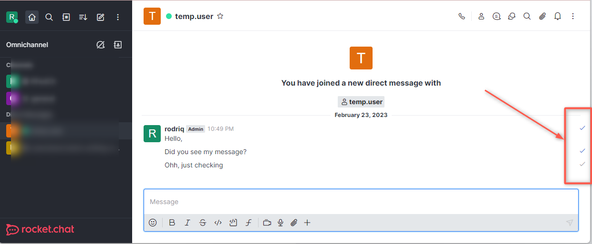

# Message

To access this menu, navigate to **Administration** > **Workspace** > **Settings** > **Message**.


Remember to hit **Save Changes** in order to apply any changes made.


## Basic Settings

* **Allow Message Pinning**: When enabled, allow messages to be pinned to any channel.
* **Allow Message Starring**: When enabled, users are able to star messages.
* **Video Recorder Enabled**: Requires `video/webm` files to be an accepted media type within [File Upload](file-upload/) settings.
* **Allow message Editing**: When enabled, users have the ability to edit messages.
* **Block Message Editing After (n) Minutes**: Takes in time in minutes in which users are allowed to edit messages. After that they are unable. Enter 0 to disable blocking.
* **Allow message-deleting**: Toggle on to allow users to be able to delete messages.
* **Block Message Deleting After (n) Minutes**: This lets you set a duration in minutes in which users are allowed to delete messages.
* **Allow Unrecognized Slash Commands**: When enabled, unknown Slash Commands are allowed.
* **Allow user direct messages to yourself**: When enabled, users are able to send direct messages to themselves.
* **Always Search Using RegExp**: When enabled, all searches use RegExp. We recommend setting this `True` if your language is not supported on [MongoDB text search](https://docs.mongodb.org/manual/reference/text-search-languages/#text-search-languages).
* **Show Deleted Status**: When enabled, shows `deleted` when a message is deleted.
* **Allow Message bad words filtering**: Turn on to allow filtering of blacklisted words in messages.
  * **Add Bad Words to the Blacklist**: Takes in a list of comma-separated words that are to be filtered from the workspace.
  * **Remove words from the Blacklist**: Takes in any word already on the Blacklist and removes it.
* **Keep Per Message Editing History**: Whether or not to keep message editing history.
* **Maximum Channel Size for ALL Message**: This lets you set the maximum size of a channel.
* **Maximum Allowed Characters Per Message**: This lets you specify the maximum number of characters a message can contain.
* **Allow converting long messages to attachments**: When enabled, long messages can be converted to attachments.
* **Grouping Period (in seconds)**: Takes in time in seconds in which messages are grouped with the previous message if both are from the same user and the elapsed time was less than the informed time in seconds.
* **Embed Link Previews**: Turn on to enable embedded link previews when links are posted in a chat.
  * **Embed Request User Agent**: This lets you set a request user agent.
  * **Embed Cache Expiration Days**: Set how long in days where embed cache expires.
  * **Embed Ignored Hosts**: Comma-separated list of hosts or CIDR addresses, eg. `localhost`, `127.0.0.1`, `10.0.0.0/8`, `172.16.0.0/12`, `192.168.0.0/16`
  * **Safe Ports**: Comma-separated list of ports allowed for previewing.
* **Time Format**: Specify the format of time on your server. See also: [Moment.js](http://momentjs.com/docs/#/displaying/format/)
* **Date Format**: Set the format of the date in your server.
* **Time and Date Format**: This lets you set the time and date format.
* **Maximum Number of Chained Quotes**: This lets you set the maximum number of Chained quotes.
* **Hide System Messages**: Select from a dropdown which system messages are to be hidden.
* **DirectMesssage\_maxUsers**: Specifies the maximum uses for direct messages.
* **Message Erasure Type**: Select from the drop-down what to do with messages of users who removed their accounts.
* **Code highlighting languages list**: Comma-separated list of languages (all supported languages at [https://github.com/highlightjs/highlight.js/tree/9.18.5#supported-languages](https://github.com/highlightjs/highlight.js/tree/9.18.5#supported-languages) ) that are used to highlight code blocks.

## Hex Color Preview

**Enabled**: Set true to allow preview for hex colors.

## Message Attachments

* **Enable image thumbnails to save bandwidth**: When set to true, thumbnails are served instead of the original image to reduce bandwidth usage. Images at original resolution can be downloaded using the icon next to the attachment's name.
  * **Thumbnail's max width (in pixels)**: Takes in the thumbnail's max width in pixels
  * **Thumbnail's max height (in pixels)**: Takes in the thumbnail's max height in pixels
* **Remove EXIF metadata from supported files**: Enable to strip out EXIF metadata from image files (jpeg, tiff, etc.). This setting is not retroactive, so files uploaded while disabled will have EXIF data

## Audio Message

* **Audio Recorder Enabled**: When set to true, users are able to record audio.
* **Audio Message Bit Rate**: Lets you set the bit rate for audio messages.

## Read Receipts

 (3) (3) (3) (3) (3) (3) (3) (3) (2) (3) (1) (1) (1) (1) (1) (1) (1) (11) (27).jpg>)

* **Show Read Receipts**: Whether to show read receipts.
* **Detailed Read Receipts**: This shows each user's read receipts.


Delivered messages have a checkmark on the right.

The checkmark turns blue when the message is read.


<figure><figcaption>
Read receipt indicator
</figcaption></figure>

With read receipt enabled, the [message info action](../../user-guides/messages/message-actions.md#message-info) shows a list of users that have read the message.

## Auto-Translate 

* **Enable Auto-Translate**: Enabling auto-translation allows users with `auto-translate` permission to have all messages automatically translated into their selected language. Fees may apply.
* **Service Provider**: A drop-down to select the translation service provider.

### DeepL 

* **API Key**: Takes in DeepL API key.

### Google 

* **API Key**: Takes in the Google API key.

### Microsoft

* **Ocp-Apim-Subscription-Key**: Takes in your Microsoft Ocp-Apim-Subscription-Key.

## Google Maps 

* **Enable Mapview**: Enabling map view displays a location share button on the right of the chat input field.
* **Google Static Maps API Key**: The Google Static Maps API Key. This can be obtained from the Google Developers Console for free.

## Katex

* **Katex Enabled**: When enabled, allows the use of [katex](http://khan.github.io/KaTeX/) for math typesetting in messages.
* **Allow Parenthesis Syntax**: When enabled, you can use \[katex block] and (inline katex) syntaxes.
* **Allow Dollar Syntax**: When enabled, allows using `$$katex block$$` and `$inline katex$` syntaxes.
