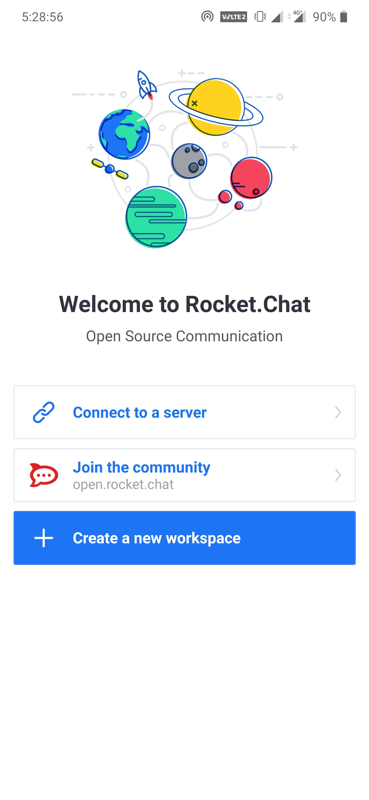
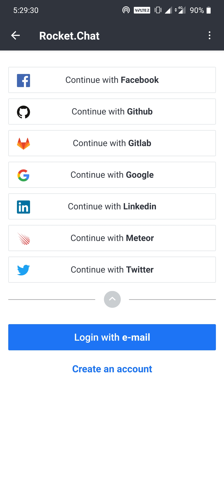
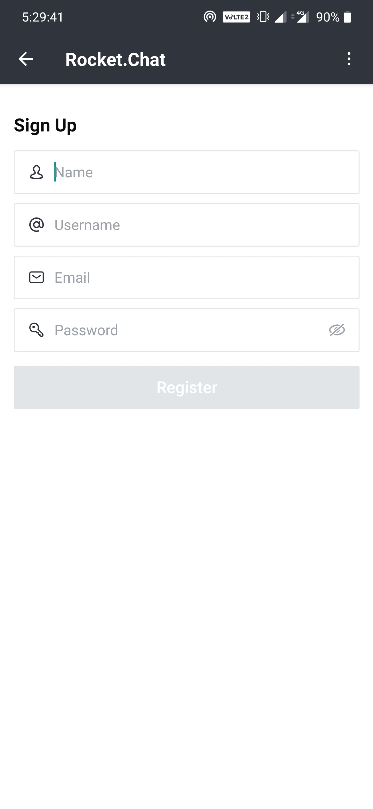
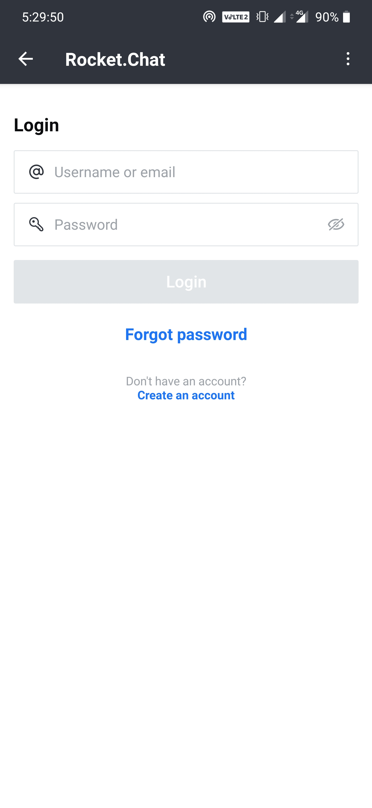
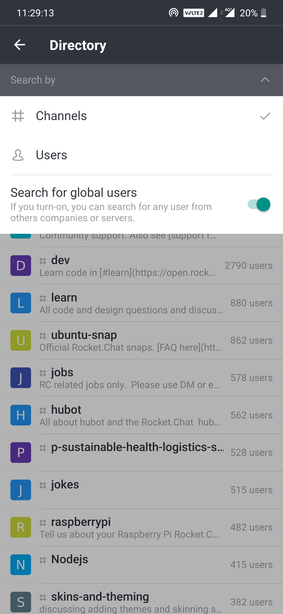
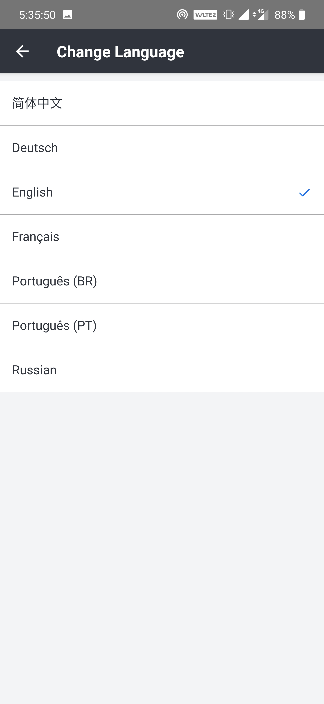
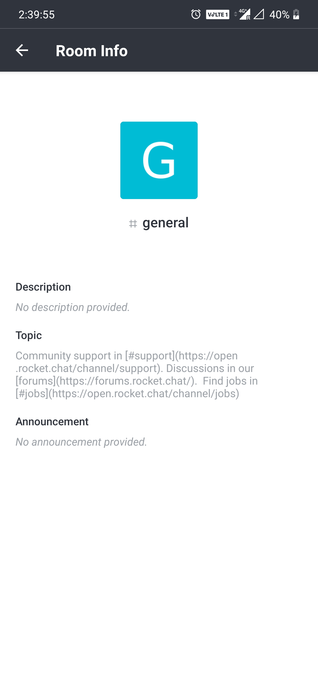
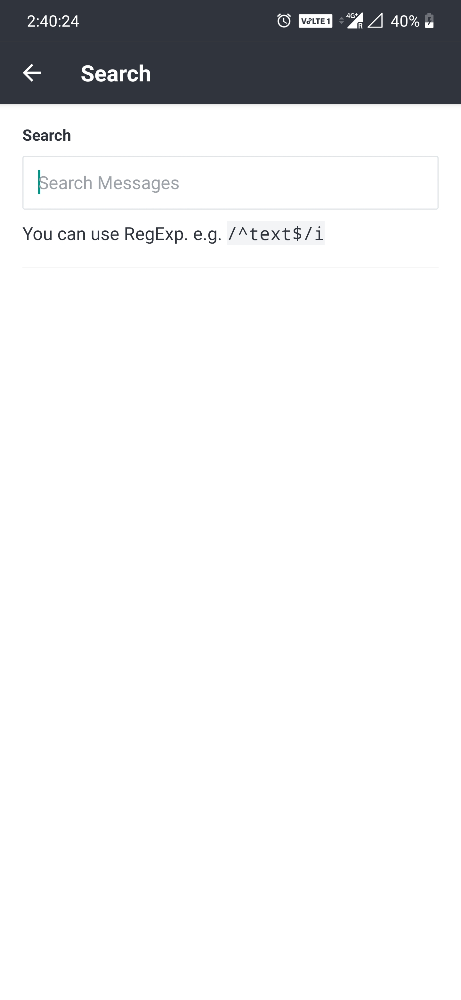
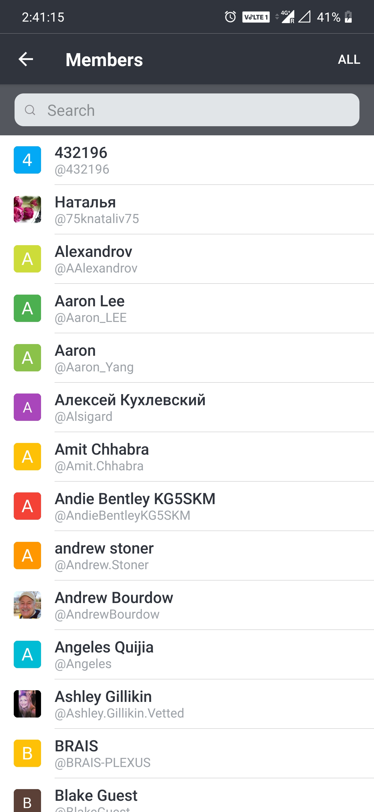

 

# Rocket.Chat Experimental (React Native)

Rocket.Chat Experimental app is built using [React Native](https://facebook.github.io/react-native/), a framework that allows us to build native apps (Android and iOS) using Javascript.
If you don't have the app already installed on your device, you can download it from here:

&nbsp;

If you've downloaded the app then, follow the below instructions to know the best features in the app.

## Connecting to a Server

  

On the first launch of the app, You will have three available options for connecting to a server :

- **Using Connect to a server** : will help you to connect to an existing server.
- **Using Join the community**  : will help you to connect to Rocket.Chat server.
- **Create a new workspace**    : will help you to create your own workspace server.

## Registration and Login

To be able to access a server you will need to first register an account manually or by using one of the many supported OAuth services (if the desired server has enabled these services) and then login. Supported OAuth services are Facebook, GitHub,GitLab, Google, LinkedIn, Meteor and Twitter.

  
  
  

## Talking to users from another server

Once you have added your server and loggedIn to your account, you can talk to users or rooms from another server who have done the same. Don't forget to turn-on the global search option.
You can search using a combination of a username and a domain or an e-mail address, like:

- Username: myfriendsusername@anotherdomain.com
- E-mail address: joseph@remotedomain.com

  

## Multiple Servers

Suppose you have one more server and want to switch between your both serves. In Rocket.Chat, You can add multiple servers too. You can switch between them like this:

  

## Multiple languages

Rocket.Chat application is supported with multiple languages too. You can switch between any languages you're comfortable with.
Current there are 7 Languages supported by Rocket.Chat. More to come soon!

  

# Room Actions

With rooms you can also do more than merely post messages and upload files, you can interact in various ways through the room actions menu.Room actions are located to the right of the room title accessible by clicking the 3 dots (⋮).

_Room actions vary depending on the server configuration, so the items listed below might not all be visible in your installation._

## Room Info

Here you can see all kinds of information about the current room. If you have the proper permissions, this information can be edited. These are the Room info options:

  

- __Room Name__: The name of the room, how users see the title and find the room via search.

- __Topic__: The topic shows next to the title on the room header. Great for giving more info on what the room is about.

- __Announcement__: The announcement is shown in a very visible bar under the room header.

- __Description__: The description of the room.

## Search Messages

Rocket Chat search supports basic search commands which work like Gmail search.

Rocket Chat also supports the use of "[regular expressions](https://en.wikipedia.org/wiki/Regular_expression)". The benefits of regular expressions are great search flexibility and the ability to search chat entries in any language, even ones which are traditionally a challenge to search (like "CJK" languages - Chinese, Japanese, Korean).

  

### Basic Search Commands

You can use these commands before or after entering search terms:

`from:me` to search for messages only created by the current user.

`from:user.name` to search for messages created by a specific user. The username entered must be the format without spaces (i.e. "john.doe" and not "John Doe". To search for any time a user was mentioned, just search for their username.

`has:star` returns messages that are starred by the current user.

`is:pinned` or `has:pin` returns messages that are pinned in the current room.

`has:url` or `has:link` returns messages that contain a link.

`has:location` or `has:map` returns messages that have a location attached.

`before:dd/mm/yyyy`, `after:dd/mm/yyyy` and `on:dd/mm/yyyy` return message that were created before, after, or on the provided date.
Dashes `dd-mm-yyyy` or dots `dd.mm.yyyy` can be used instead of slashes.

`order:asc`, `order:ascend`, or `order:ascending` sorts messages by ascending timestamp.

`order:desc`, `order:descend`, or `order:descending` sorts messages by descending timestamp.

You can also jump to where a message is located by hovering the mouse over the search result and selecting `jump to message`.

### Regex

These references tell more about the powerful world of regex:

- Wikipedia - <https://en.wikipedia.org/wiki/Regular_expression>
- Regex 101 - <https://regex101.com/#javascript>
- Regexr - <http://regexr.com/>
- Regex Info - <http://www.regular-expressions.info/javascriptexample.html>

## Members List

Here you can see all the users on room and see more information about them. If you have the proper permission, you can manage them on your room.

  

To see more information on a user, click their name on the list.

You will be redirected to:

- Start a direct conversation with the user.

- Start a voice message with the user.

## Notifications

You can change the behavior of notifications for rooms where you are a member. By default, a room notifies you whenever someone mentions you or uses the `@all` mention.

These options are on the room notifications tab:

- __Disable Notifications__: disable all notifications for the room.

## Files List

A list of all the files uploaded to the current room.

## Mentions

All messages which mentioned you in the current room.

## Starred Messages

All messages which you have starred in the current room.

## Pinned Messages

All messages that were pinned on the current room.