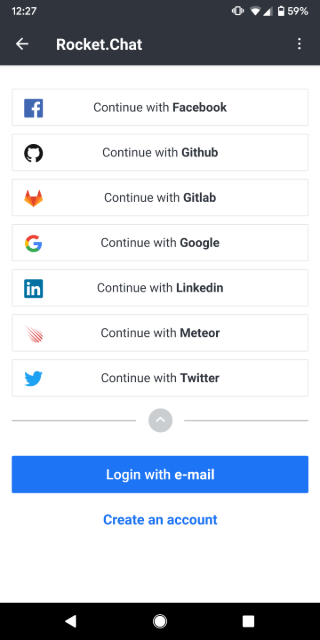
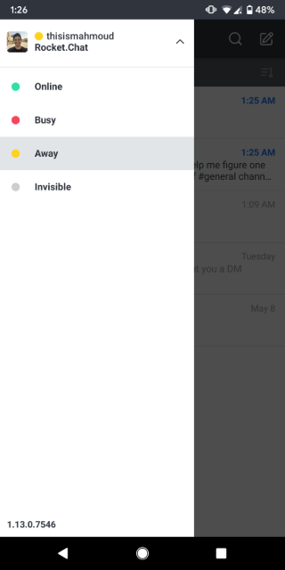

# Rocket.Chat Experimental (React Native)

Welcome to the official Rocket.Chat Experimental app user docs! Here you'll learn about all the features and things you can do with the app.
Why is it called _"Experimental"_? Well this mobile app is built using [React Native](https://facebook.github.io/react-native/), a framework that allows us to build both Android and iOS versions of our mobile app, using a single codebase.
Anyway, let's get started shall we?
If you don't have the app already installed on your device, you can download it right here:

- [Google Play Store](https://play.google.com/store/apps/details?id=chat.rocket.reactnative)
- [Apple App Store](https://itunes.apple.com/us/app/rocket-chat-experimental/id1272915472?mt=8)

## Connecting to a server

When you first launch the app, you'll get a screen that looks like this:


You have three available options, you can either:

- **Join the community**: this means you'll be using the [https://open.rocket.chat] server.
- **Connect to a server**: if you want to connect to an existing server.
- **Create a new workspace**: if you want to create your own workspace. You define the name of the server, the pricing plan and more.

## Registration and Login

You can create an account using your email and password, or you can go with the quicker option, which is to login using Facebook, GitHub,GitLab, Google, LinkedIn, Meteor and Twitter.



---

## Channels

Channels are where the magic happens; here you'll find all of your messages and conversations.
If you are using [https://open.rocket.chat] server, you'll have by default the **#general** channel.
You can also look up the name of users and start chatting with them right away.


### Adding a server

You can have multiple servers associated with your account, you can add ones and easily switch between them like this:


### Sorting

We give you the option to sort your channels _alphabetically_ or you can sort them based on _activity_. Choosing the latter will put the most recent conversations at the top.


### Grouping

### Channel Actions

You can display the channel actions by clicking the &#8942; menu icon at the top right when you're inside the channel. You can view all members, all the files that were sent, your starred and pinned messages. You can also search for messages if you're looking for something particular. Also, you have the option to disable notifications for the channel. Finally, you can choose _"leave channel"_ to leave this particular channel.


---

## Status

Your status lets people know if you're available. To change your status, swipe right to reveal the navigation drawer, then click on the down arrow icon to display the different options. You can choose _available_, _away_, _offline_ or _invisible_.



## Messaging

Want to inject some flavor into your everyday text chat? Rocket.Chat uses Markdown, a simple plain text formatting system that'll help  make your texts look different and stand out. Here's how to do it! All you have to do is add few characters before & after your desired text (no spaces) to change the way it looks! Here are some examples...

|      Symbol       |    effect     |    example    |
|:-----------------:|:-------------:|:-------------:|
|    _ _ or * *     |    italic     |     _hi_      |
|       ~ ~         |strike-through |    ~test~     |
|    __ __ or ** ** |     bold      |   **Hello**   |

Also, if you wrap text in three ``` , it will be styled as a code snippet, this makes explaining code in messages a much better experience, since you can visually distinguish between code and text.

You can create a hyperlink, meaning a word  will become a clickable link by doing the following:
 `[word](link)`. This will allow you to keep your messages concise and more organized.


If you start a message using the ">" character, your message will be styled as a quote. Here's what it will look like:
<!-- image here -->

You can also send voice messages by clicking the :microphone: icon and send pictures by pressing the :heavy_plus_sign: icon. You can either pick from your gallery or take a photo.

## Customizing your profile

You can change your display name, your username, your avatar, your password and add details about yourself like where you're from, what languages you speak and more.

## Coming Soon

We're still working on this version of the app and a lot more features will be implemented. It's open source, so if you'd like to contribute, you can do it right [here](https://github.com/RocketChat/Rocket.Chat.ReactNative).
